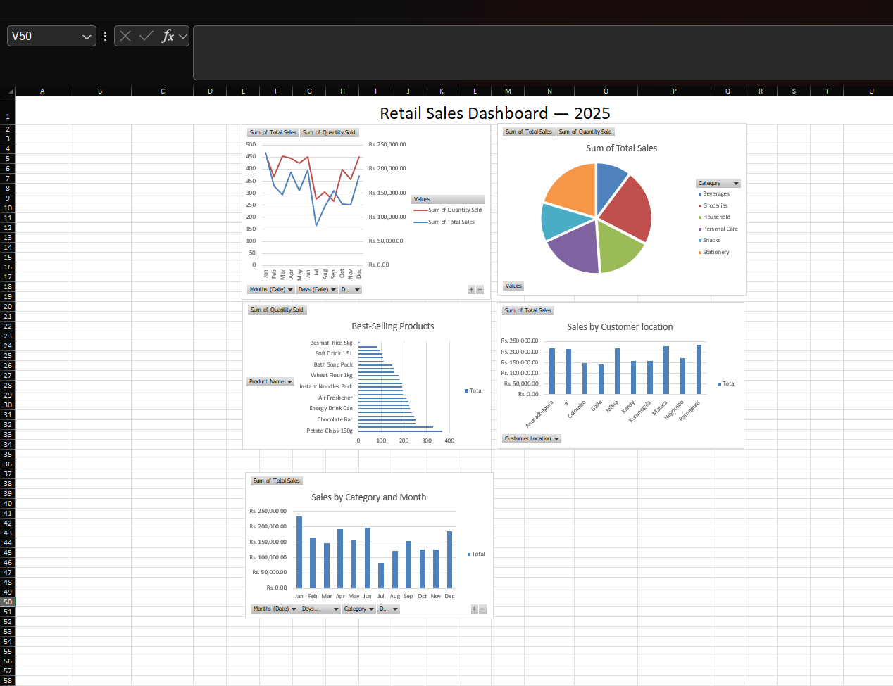

# Retail Sales Dashboard

A beginner Excel project analyzing sales data for a small retail shop using PivotTables, charts, and a consolidated dashboard.

## What's Included
- **Raw Sales Data** — 220 sample sales records with product name, category, quantity sold, price, date, and customer location
- **5 PivotTables** covering:
  - Monthly sales trend
  - Best-selling products
  - Revenue by category
  - Sales by customer location
  - Category-by-month breakdown
- **5 Charts** — line chart, pie chart, bar charts, and column charts visualizing the above
- **Dashboard sheet** — all charts consolidated into a single view

## Tools Used
- Microsoft Excel (PivotTables, PivotCharts, formulas, dual-axis charts)

## Skills Demonstrated
- Data organization and formula-driven calculations (no hardcoded values)
- PivotTable design (rows, values, sorting)
- Chart selection based on data type (trend vs. comparison vs. proportion)
- Dashboard layout and visual design
